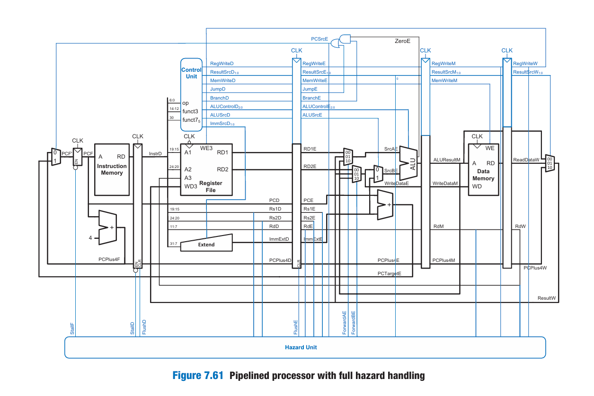

## RISC-V Pipelined Processor
This is a Verilog implementation of a 5-stage pipelined RISC-V processor based on the RV32I instruction set architecture. It supports key instructions including arithmetic, load/store, branch, and jump. The pipeline structure improves performance by overlapping instruction execution.

##  Pipelined CPU Architecture

Below is the architecture of the 5-stage pipelined RISC-V CPU with full hazard handling.

##  Features

- RV32I instruction support
- 5-stage pipeline: Fetch, Decode, Execute, Memory, Writeback
- Hazard detection and forwarding logic
- ALU with support for add, sub, and/or/xor/slt
- Testbench for simulation and verification

- ## Project Structure
- `pipeline_processor.v` - Top level module
- `riscv.v` - Core CPU integration
- `datapath.v` - All datapath components
- `controller.v` - Controller for control signals
- `alu.v` - Arithmetic logic unit
- `extend.v` - Sign extension to 32 bits
- `hazard.v` - Hazard unit
- `imem.v / dmem.v` - Instruction and data memory
- `regfile.v` - Register file
- `testbench.v` - Testbench for simulation
- `regfile.hex` - Initial register values
- `instruction.hex` - Machine code as instructions

- ## How to Run
- Compile all `.v` files in Vivado
- Add `regfile.hex` and `instruction.hex` files as memory files
- Run the testbench `testbench.v`

- 
  
  
  
